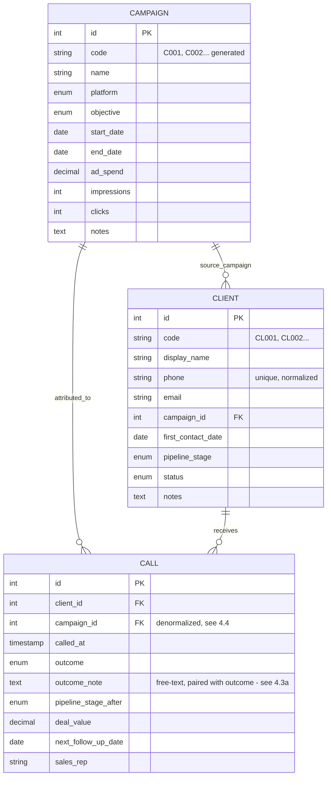

# Sales Call Tracker — Developer Briefing

**Rebuilding the Facebook/Instagram ad → WhatsApp/phone lead tracker as a real web app**

Author's context: a solo operator runs Facebook/Instagram "Click to WhatsApp" ad campaigns for a clinic-management SaaS product. Leads message on WhatsApp or call directly; the operator manually dials them back, logs the outcome, and tracks the deal through a pipeline to close. This has been running as a heavily-engineered Excel workbook (Tables, auto-IDs, protected formulas, dropdowns). The workbook works, but every session fighting Excel's UI (broken dropdowns on save, re-typing numbers, no real search, no phone access) is the reason for this rebuild. **The web app's entire value proposition is fewer clicks and less typing than Excel — every screen below should be judged against that bar.**

This revision sharpens three things the first draft under-specified: calling a lead directly from the list (not just logging a call for them), reviewing a lead's full call history in one place, and treating the call outcome note as its own first-class text field alongside the outcome status — plus a deeper pass on reporting and lead tracking, which are the actual point of the app.

This document is a complete brief for a developer (or an AI coding agent) to build the MVP. It assumes no prior context beyond what's written here.

---

## 1. Goals and non-goals

**Goals**
- Call a lead with one tap, directly from the leads list — no detour through a detail page first.
- Log a call in under 10 seconds from any device, especially a phone.
- Review every past call with a lead — outcome, stage, value, and the free-text note — in one scroll, newest first.
- Capture *why* a call went the way it did as a real note, not just a status label.
- Never retype a phone number or campaign name that's already in the system.
- Find any lead by typing part of their name *or* their phone number, from anywhere in the app.
- Track leads as they age: who hasn't been called, whose follow-up is overdue, who's gone quiet.
- See, at a glance: how many leads a campaign produced, how many turned into calls, how many closed, and what it cost.
- Import a batch of leads (pasted phone numbers) in one action instead of one-by-one.

**Non-goals for v1**
- Multi-tenant / multi-organization support.
- Automated WhatsApp message ingestion (no WhatsApp Business API integration in v1 — leads are still added manually, just far faster than Excel).
- Complex role-based permissions. Assume one owner account; design the data model so a second "Sales Rep" user can be added later without a rewrite (see §4.6).

---

## 2. Tech stack

| Layer | Choice | Why |
|---|---|---|
| Framework | **Next.js 16** (App Router), TypeScript, React 19.2 | Server Actions remove the need for a separate REST API layer for a single-frontend app — less code, fewer round trips. Next.js 16 specifics (Turbopack default, Cache Components, async request APIs) are pinned in §12. |
| Database | PostgreSQL | Relational integrity (campaigns → clients → calls) matters here; this is exactly what killed the Excel version's naive name-matching. |
| ORM | TypeORM | Requested explicitly. Use the DataSource + Repository pattern, not the ActiveRecord style — keeps entities as plain data and business logic in services, which is easier to test. |
| Styling | Tailwind CSS | Requested explicitly. |
| Component primitives | shadcn/ui (Radix-based, copy-in components, not a runtime dependency) | Gives accessible `Command` (⌘K search), `Dialog`, `Sheet` (mobile bottom-sheet), and `Combobox` for free — these four components are most of the "minimal click" UX below. Staying framework-light keeps this "minimal" rather than pulling in a heavy admin-panel library. |
| Charts | Tremor (built on Tailwind + Recharts) | Fastest path to KPI cards and the funnel/bar/pie/trend charts in §8, styled consistently with zero custom chart CSS. |
| Forms & validation | React Hook Form + Zod | One Zod schema per entity, shared between the client form and the server action that persists it — the same validation runs in both places. |
| Auth | Lucia or a minimal cookie/JWT session (not NextAuth) | One owner login; NextAuth's OAuth machinery is unneeded weight for a single-credential app. |
| Hosting | Vercel (app) + Neon or Supabase (Postgres) | Both give pooled/serverless-friendly Postgres connections, which matters because TypeORM's default connection pooling doesn't suit serverless functions well — **use the provider's pooled connection string**, not a direct connection, or you will exhaust connections under load. |
| Dates | date-fns | Lightweight, tree-shakeable. |
| Code style | No comments in application source — self-documenting names, small functions, prose docs live in this file and in `AGENTS.md`, not inline | See §15. |

---

## 3. The one idea to hold onto: phone number is identity

The single biggest lesson from the Excel version: **a person's name is not a reliable key.** Leads arrive with no name at all (just a WhatsApp number), get named later, sometimes inconsistently. Every bug that came up while building the spreadsheet traced back to matching on name text instead of a stable ID.

Rule for the rebuild: **`Client.phone` (normalized) is the true identity.** Every join, every lookup, every duplicate check goes through phone or the numeric primary key — never through the display name.

---

## 4. Data model

### 4.1 Entity overview (ERD)



### 4.2 TypeORM entities (sketch)

Per the no-comments rule in §15, these sketches carry zero inline comments — every piece of context that would otherwise live in a comment is stated here in prose instead, and the property names are chosen to be self-explanatory on their own. `Campaign.code` (e.g. `"C001"`) is generated in a service/trigger per §4.5, never set by hand. On `Client`, `phone` is kept only for display exactly as typed, while `phoneNormalized` (digits only, e.g. `"251921234567"`) is the column every query, join, and uniqueness check must use — never `phone`. `Client.notes` is a general note about the person, independent of any single call, distinct from `Call.outcomeNote`. On `Call`, `campaign` is copied at creation time rather than derived from `client.campaign` — the full reasoning is in §4.4 — and `outcomeNote` is the "what actually happened" field described in §4.3a. `Call.updatedAt` exists because calls are editable, subject to the caveat in rule 5 of §5.

```typescript
@Entity()
export class Campaign {
  @PrimaryGeneratedColumn() id: number;
  @Column({ unique: true }) code: string;
  @Column() name: string;
  @Column({ type: "enum", enum: Platform }) platform: Platform;
  @Column({ type: "enum", enum: CampaignObjective }) objective: CampaignObjective;
  @Column({ type: "date", nullable: true }) startDate: string;
  @Column({ type: "date", nullable: true }) endDate: string;
  @Column({ type: "decimal", precision: 12, scale: 2, default: 0 }) adSpend: string;
  @Column({ type: "int", default: 0 }) impressions: number;
  @Column({ type: "int", default: 0 }) clicks: number;
  @Column({ type: "text", nullable: true }) notes: string;
  @OneToMany(() => Client, (c) => c.campaign) clients: Client[];
  @OneToMany(() => Call, (c) => c.campaign) calls: Call[];
  @CreateDateColumn() createdAt: Date;
}

@Entity()
@Index(["phoneNormalized"], { unique: true })
export class Client {
  @PrimaryGeneratedColumn() id: number;
  @Column({ unique: true }) code: string;
  @Column({ nullable: true }) displayName: string;
  @Column() phone: string;
  @Column() phoneNormalized: string;
  @Column({ nullable: true }) email: string;
  @ManyToOne(() => Campaign, (c) => c.clients) campaign: Campaign;
  @Column({ type: "date", nullable: true }) firstContactDate: string;
  @Column({ type: "enum", enum: PipelineStage, default: PipelineStage.NEW_LEAD }) pipelineStage: PipelineStage;
  @Column({ type: "enum", enum: ClientStatus, default: ClientStatus.LEAD }) status: ClientStatus;
  @Column({ type: "text", nullable: true }) notes: string;
  @OneToMany(() => Call, (c) => c.client) calls: Call[];
  @CreateDateColumn() createdAt: Date;
  @UpdateDateColumn() updatedAt: Date;
}

@Entity()
export class Call {
  @PrimaryGeneratedColumn() id: number;
  @ManyToOne(() => Client, (c) => c.calls) client: Client;
  @ManyToOne(() => Campaign, (c) => c.calls) campaign: Campaign;
  @Column({ type: "timestamptz" }) calledAt: Date;
  @Column({ type: "enum", enum: CallOutcome }) outcome: CallOutcome;
  @Column({ type: "text", nullable: true }) outcomeNote: string;
  @Column({ type: "enum", enum: PipelineStage }) pipelineStageAfter: PipelineStage;
  @Column({ type: "decimal", precision: 12, scale: 2, nullable: true }) dealValue: string | null;
  @Column({ type: "date", nullable: true }) nextFollowUpDate: string | null;
  @Column({ nullable: true }) salesRep: string;
  @CreateDateColumn() createdAt: Date;
  @UpdateDateColumn() updatedAt: Date;
}
```

Each file above corresponds to one entity (`campaign.entity.ts`, `client.entity.ts`, `call.entity.ts`) per the folder layout in §12.2 — the filenames are not restated as header comments in the file itself; the file's location and export already say what it is.

### 4.3 Picklists: database-backed, not hardcoded enums

The Excel version kept Call Outcome, Pipeline Stage, Platform, Objective, and Status on a hidden "Lists" sheet specifically so the wording could be tweaked without touching formulas — and that flexibility got used (the outcome and stage lists were rewritten mid-project to be richer). **Don't hardcode these as Postgres/TypeScript enums.** Use a `PicklistOption` table instead:

```typescript
@Entity()
export class PicklistOption {
  @PrimaryGeneratedColumn() id: number;
  @Column() listKey: "call_outcome" | "pipeline_stage" | "platform" | "objective" | "client_status";
  @Column() value: string;         // stable key stored on Call/Client, e.g. "answered_interested"
  @Column() label: string;         // display text, e.g. "Answered - Interested"
  @Column() colorToken: string;    // "green" | "red" | "gold" | "blue" | "grey" — drives the badge color in the UI
  @Column({ default: 0 }) sortOrder: number;
  @Column({ default: true }) active: boolean;  // soft-disable instead of delete, so historical calls keep their label
}
```
Seed it with the exact lists already validated in the spreadsheet (reproduced in full in §10). A Settings page lets the owner add/reorder/rename options later — this is the one place they should never need a developer again.

### 4.3a Outcome status and outcome note are two separate fields — always shown together

This was already true in the spreadsheet (an "Outcome" dropdown column and a free-text "Notes" column side by side) and it carries over exactly:

- **`outcome`** (`CallOutcome`, required) — the structured status. This is what every report, filter, and KPI counts on. It must always be one of the picklist values, never free text, or the reporting in §8 silently breaks.
- **`outcomeNote`** (text, optional but always visible) — what actually happened, in the operator's own words: "asked for pricing for 3 branches, said she'd check with her partner," "wrong number, belongs to a pharmacy now," "very interested, wants a demo Thursday." This is the field that makes the call review in §6.4a actually useful — an outcome badge alone doesn't tell you what to say when you call back.

**UI rule:** in every place a call is logged or edited, the outcome selector and the outcome note textarea sit directly next to each other (note below status, never on a different tab or behind a "more details" toggle). In every place a call is displayed (client detail timeline, reports drill-down, CSV export), the note is shown in full underneath the outcome badge, not truncated to a tooltip.

### 4.4 Why `Call.campaignId` is copied, not derived from `Client.campaign`

A client's campaign attribution can be edited later (a lead gets recategorized). If `Call` only looked up campaign through `client.campaignId`, editing a client would silently rewrite the campaign attribution of every historical call, corrupting past reporting. **Set `Call.campaignId` once, at creation time, from whatever the client's campaign was at that moment, and never recompute it.** This is the same fix applied to the spreadsheet (originally calls matched by client *name*, which broke the moment a client was renamed; the fix was matching by a stable ID and freezing it per row).

### 4.5 Auto-generated human-readable codes

Keep the `C001` / `CL001` style codes purely as a cosmetic, generated field — never as the primary key or join key (that's always the integer `id`). Implement with a Postgres sequence per entity type and a trigger, or in the TypeORM `@BeforeInsert` hook:
```typescript
@BeforeInsert()
async setCode(dataSource: DataSource) {
  const seq = await dataSource.query(`SELECT nextval('client_code_seq')`);
  this.code = `CL${String(seq[0].nextval).padStart(3, "0")}`;
}
```
A DB sequence (not `COUNT(*) + 1`) avoids collisions under concurrent inserts — the bulk-import feature in §6.2 will insert many rows at once.

### 4.6 Multi-rep readiness (not built in v1, but don't block it)

Add a nullable `assignedUserId` on `Client` and `salesRep` stays a plain string on `Call` for v1. When a second rep is added later, `salesRep` becomes a FK to a `User` table and a "my leads vs. all leads" filter appears, and §7's lead-tracking views split by rep — no schema migration surprises if the column already exists as nullable.

---

## 5. Business rules (enforce in a service layer, not just the UI)

1. **Phone uniqueness.** Creating a client with a phone that normalizes to one already in the database must fail with a clear "already exists as CL0xx — open them instead?" message, not a raw DB constraint error.
2. **Logging a call updates the client.** When a call is saved with a `pipelineStageAfter`, the client's `pipelineStage` is updated to match, in the same database transaction. This is the one place a "trigger vs. app code" call matters — do it in the service function that creates a `Call`, wrapped in a transaction with the client update, so it can never partially apply.
3. **A call requires an existing client.** No orphan calls. If the person calling doesn't exist yet, the quick-log flow must offer "add as new client" inline (see §6.2) rather than allowing a free-text name that goes nowhere.
4. **Soft-disable, never hard-delete picklist options that are in use.** Deleting a `PicklistOption` row that any `Call` or `Client` still references would corrupt history; check for references and disable instead.
5. **Calls are editable, with a caveat.** Mis-logging an outcome or fat-fingering a deal value should be fixable without calling a developer. Allow editing any `Call` row (updates `updatedAt`), but if the edited call is the *most recent* call for that client, re-run the client-stage-update side effect from rule 2 so the client record doesn't end up stuck on a stage that came from a since-corrected call. Editing an older call never touches the client's current stage.

---

## 6. UX workflow — the minimal-click screens

Every screen listed here should be reachable in ≤2 clicks/taps from the bottom navigation (mobile) or sidebar (desktop): **Home, Leads, Campaigns, Reports.** "Log a call" is not a 5th nav item — it's a floating action button and a global keyboard shortcut, always available (§6.2).

### 6.1 Leads list — call directly from here, this is the main screen

This is where the operator spends most of their time, and calling someone should never require leaving it.

- Searchable (name or phone), filterable (stage, status, campaign, "no calls yet", "overdue follow-up" — see §7), sortable table on desktop; card list on mobile.
- Each row: name/phone, campaign badge, stage badge (color from `PicklistOption.colorToken`), last call date, next follow-up date (highlighted red if overdue), call count.
- **Row actions, always visible as icon buttons — never behind a "..." menu:**
  - **📞 Call** — a `tel:<phoneNormalized>` link. On mobile this opens the native dialer immediately, no confirmation step. Tapping it *also* opens the Quick Log Call sheet (§6.2) pre-filled to this client, so the moment the operator hangs up and switches back to the browser tab, the logging form is already sitting there waiting — they never have to search for the lead a second time.
  - **💬 WhatsApp** — `https://wa.me/<phoneNormalized>`, opens the chat directly.
  - **📝 Log call** — opens Quick Log Call without dialing, for calls placed from a separate phone.
- Clicking anywhere else on the row opens **client detail** (§6.4a) — a side drawer on desktop, a full page on mobile.

### 6.2 Quick Log Call — the core logging interaction (⌘K / floating "+" button, or the row action above)

This is the single feature the whole app is built around, and it directly replaces the most painful manual step in the spreadsheet workflow.

- Press **⌘K** (desktop) or tap the floating **+** button (mobile, thumb-reachable bottom-right) from *any* screen — or tap a lead's 📞/📝 icon in the leads list, which skips straight to step 2 below already pre-filled.
- **Step 1 — find the client:** a search box (shadcn `Command`) searching **name or phone** as you type — server action does `WHERE phone_normalized LIKE $1 OR display_name ILIKE $1`, debounced 150ms.
- **Step 2 — log the call**, one short form:
  - **Outcome** — searchable select, required (§4.3a).
  - **Outcome note** — a multi-line textarea directly beneath it, always visible, never optional-feeling even though technically nullable (§4.3a).
  - **Pipeline Stage** — defaults to a sensible next stage based on the chosen outcome (e.g. "Converted / Sale" pre-selects "Closed Won"), remains editable.
  - **Deal value** — only shown once outcome/stage suggests a close.
  - **Next follow-up date** — `+3 days` / `+1 week` quick-pick chips alongside the raw date input, not just a bare calendar.
- If the search in Step 1 matches no one, offer **"Add [phone/name] as a new client"** inline — creating the client and logging the call in one submit, no context switch to a separate "add client" page.
- Submit: optimistic UI (the call appears at the top of the client's call history instantly; the KPI strip and lead-tracking views update without a full page reload), single toast confirmation. Total interaction target: **under 10 seconds** for an existing client, dial-to-logged.
- On mobile this dialog is a bottom sheet (shadcn `Sheet`), not a centered modal — reachable one-handed while still holding the phone from the call.

### 6.3 Bulk Import Leads

This directly replaces the recurring manual task of extracting phone numbers from WhatsApp screenshots and pasting them into Excel row by row.

- A dedicated screen: a large textarea ("Paste phone numbers — one per line, or pasted straight from anywhere") + a **Campaign** picker.
- On paste, a regex extracts phone-number-shaped substrings (international format, spaces/dashes tolerated) and renders a preview table: number, and a badge showing **New** or **Already exists (→ CL0xx)**.
- One **"Import N new leads"** button. Duplicates are skipped automatically and reported in the confirmation ("21 added, 11 already existed").
- Every imported row gets `pipelineStage = New Lead`, `status = Lead`, `firstContactDate = today`, and the chosen campaign — matching exactly how leads have been onboarded so far.
- Stretch goal (v2): accept a pasted **image** (screenshot) and OCR it server-side instead of requiring pre-extracted text — the literal next step up from what's been happening in this conversation by hand.

### 6.4 Home / Today dashboard (default landing page)

- KPI strip across the top (Tremor cards): Total Leads, Calls Made, Conversion Rate, Total Revenue, Ad Spend, ROAS, Avg Deal Value, Cost per Lead. Each is a live aggregate query, not a stored/cached number — correctness over speed at this data volume.
- **"Due today / overdue"** follow-ups list immediately below — the single most action-oriented widget on the page. Each row has the same one-tap **Call** action as the leads list.
- **"Needs attention"** widget (see §7.1): leads with no call yet, leads gone quiet.
- A compact recent-activity feed (last 10 calls logged, outcome note included).

### 6.4a Client detail & call review

The full history of a lead, in one place — this is what "reviewing all my calls with a lead" means concretely.

- Header: name/phone (both tappable — call/WhatsApp icons here too), campaign badge, current stage and status badges, inline-editable profile fields.
- **Quick Log Call** button pinned at the top — logging a follow-up call from here needs no search step, the client is already known.
- **Call history**, reverse-chronological, the main content of the page:
  - Each entry: date/time, outcome badge, stage-after badge, deal value (if any), sales rep, and the **outcome note shown in full**, never truncated.
  - A count at the top ("14 calls with this lead") and the days-since-first-contact.
  - Each entry has an **edit** action (see §5.5) and a **delete** action for genuine mis-logs (soft-delete, keep the row with a `deletedAt` timestamp rather than hard-deleting, so reporting can still be audited if a number looks off later).
  - No pagination needed at this data volume (tens, not thousands, of calls per lead) — render the full list.

### 6.5 Campaigns

- Card grid: name, platform badge, date range, and four mini-stats (leads, calls, conversion rate, ROAS) computed live.
- Click a campaign → its detail page: the same stats larger, plus its funnel chart and a Leads table pre-filtered to that campaign.
- "New Campaign" is a short single form (name, platform, objective, dates, spend) — spend/impressions/clicks are editable any time as real numbers come in from Ads Manager.

### 6.6 Reports

See §8 for the exact metrics. This screen is filters (date range, campaign) at the top, then the charts and tables from §8 below, plus **Export CSV** on every table — the one deliberate escape hatch back to spreadsheet-land, for anything that needs to leave the app.

### 6.7 Settings

- Manage picklist options (§4.3): add, rename, reorder, disable per list, with a live preview of the badge color.
- Manage the owner's login credentials.

---

## 7. Lead tracking

This is the app's second reason to exist (the first is logging calls fast) — knowing which leads are being neglected, not just how many exist.

### 7.1 "Needs attention" — the operational core

A saved view (surfaced on the Home dashboard, and as filter presets on the Leads list) covering:
- **Never called** — `Client` rows with zero `Call` rows. These are the leads that fell through the cracks; the ones sitting furthest back in a WhatsApp chat list are exactly the ones this used to lose track of.
- **Overdue follow-up** — `nextFollowUpDate` on the most recent call is in the past and the client isn't yet `Closed Won`/`Closed Lost`.
- **Gone quiet** — no call logged in the last N days (configurable, default 14) while still in an open stage (not Closed Won/Lost, not Do Not Contact).
- **Stuck in stage** — in the same `pipelineStage` for longer than a threshold that varies by stage (e.g. "Demo Scheduled" for >7 days probably means the demo needs rescheduling; "New Lead" for >3 days means nobody's called them yet).

Each of these is a saved SQL query behind a named filter chip, not a bespoke page — clicking one just filters the Leads list (§6.1).

### 7.2 Lead aging & funnel position

- Every lead shows **days since first contact** and **days in current stage** — both are cheap derived values (`now() - firstContactDate`, `now() - (most recent call's calledAt where pipelineStageAfter changed)`), surfaced as a column on the Leads list and prominently on client detail.
- The **pipeline funnel** chart (§8) is this same idea aggregated: how many leads are sitting at each stage right now, not just how many ever passed through it.

### 7.3 Follow-up compliance

- Track, per week, what fraction of follow-ups that were *due* actually got a call logged that week vs. slipped to overdue. This is the one metric that answers "am I actually staying on top of this" better than a raw follow-up count — a KPI card on Reports (§8), not just the Home widget.

### 7.4 Source attribution stays intact end-to-end

Every lead carries its originating campaign from the moment it's created (via manual add, bulk import, or eventually an integration) through every call and into every report — this is just §4.4's rule restated from the tracking angle: you should always be able to answer "which ad brought me this specific lead," not just "which ad performed well in aggregate."

---

## 8. Reporting

All of the following are the same formulas already validated in the spreadsheet version — carry the definitions over exactly so historical numbers don't shift when switching systems — plus a few that a live database makes possible for the first time.

### 8.1 Core metrics (carried over from Excel, unchanged)
- **Leads** (per campaign or total) = count of `Client` rows.
- **Calls Made** = count of `Call` rows.
- **Conversion Rate** = count of clients with `pipelineStage = Closed Won` ÷ Leads.
- **Total Revenue** = sum of `dealValue` where `pipelineStageAfter = Closed Won`.
- **Cost per Lead** = `adSpend` ÷ Leads, per campaign.
- **ROAS** = Total Revenue ÷ `adSpend`, per campaign.
- **Avg Deal Value** = Total Revenue ÷ count of Closed Won calls.

### 8.2 New metrics, made practical by having a real database
- **Time to close** — average days between a client's `firstContactDate` and the `calledAt` of the call that set `pipelineStageAfter = Closed Won`. Answers "how long does a typical deal take," which a flat spreadsheet couldn't compute without manual date math.
- **Calls to close** — average count of `Call` rows per client, for clients that reached Closed Won. Tells you how many touches a deal typically needs.
- **Outcome distribution over time** — the outcome breakdown donut (§8.3), but as a stacked trend by week, so a spike in "No Answer" or "Wrong Number" (bad number list, bad time of day) is visible immediately instead of buried in a flat pie chart.
- **Follow-up compliance** — from §7.3.
- **Rep leaderboard** — calls made and conversion rate per `salesRep`. Only one row in v1, but the query and chart should already be rep-grouped so it's a UI toggle away from useful once §4.6 lands.

### 8.3 Charts (Reports screen, §6.6)
- **Pipeline funnel** — current lead count at each stage, ordered per §10.2.
- **Call outcome breakdown** (donut) — and its trend-over-time variant from §8.2.
- **Campaign comparison** (grouped bar: leads / conversions / revenue per campaign).
- **Calls-over-time** (line, daily or weekly bucket depending on range length).
- **Revenue and ROAS over time** (line, by campaign) — not just the current snapshot, so a campaign's performance trajectory is visible, not only its total-to-date.

### 8.4 Implementation note

Implement §8.1–8.2 as SQL views (`campaign_stats`, `client_stats`, `weekly_activity`) rather than recomputing ad hoc in every query — one definition, reused by the dashboard, the campaign detail page, the lead-tracking filters in §7, and CSV export.

---

## 9. Responsive design requirements

- Design mobile-first; verify at 375px width before anything wider. This app will be used mid-call, one-handed, far more than at a desk.
- Bottom tab navigation on mobile (Home / Leads / Campaigns / Reports), sidebar on desktop (≥768px).
- Every dialog (Quick Log Call, client edit) is a bottom sheet on mobile, a centered modal on desktop — shadcn's `Dialog`/`Sheet` pairing handles this with one responsive wrapper component.
- Tap targets ≥44px; the call icon in the leads list and the floating Log Call button especially — these get tapped the most, and often one-handed.
- Tables collapse to stacked cards below the `md` breakpoint — never a horizontally-scrolling table on a phone.

---

## 10. Appendix: exact picklist seed data

Carry these over verbatim from the validated spreadsheet version so nothing is renamed out from under existing habit. Note that "Outcome" below is always paired with a free-text **outcome note** field per §4.3a — it is never the only place a call's detail lives.

### 10.1 Call Outcome
Answered - Interested · Answered - Not Interested · Answered - Requested More Info · Answered - Requested Demo · Callback Requested · Answered - Price Objection · Answered - Requested Discount · No Answer · Busy / Line Engaged · Voicemail Left · Wrong Number · Number Invalid / Disconnected · Call Dropped · Language Barrier · Decision Maker Unavailable · Do Not Call - Opted Out · Follow-up Scheduled · Converted / Sale

### 10.2 Pipeline Stage (in funnel order)
New Lead → Attempted Contact → Contacted → Qualified → Demo Scheduled → Demo Completed → Proposal Sent → Negotiation → Verbal Commitment → Contract Sent → Closed Won *(or Closed Lost, Not Qualified, On Hold, Nurture / Re-engage Later as exit/side branches)*

### 10.3 Platform
Facebook · Instagram · Facebook & Instagram · Other

### 10.4 Client Status
Lead · Prospect · Customer · Lost · Do Not Contact

### 10.5 Campaign Objective
Lead Generation · Messages · Calls · Conversions · Traffic · Engagement

---

## 11. Suggested build order (MVP phasing)

1. **Schema & migrations** — all entities in §4 (including `outcomeNote`), seeded picklists from §10, phone normalization utility with unit tests.
2. **Core CRUD** — Campaigns, Clients, Calls: create/edit/list, no polish yet.
3. **Leads list with click-to-call + Quick Log Call (§6.1, §6.2)** — the flagship interaction; get dial → hang up → log feeling instant before building anything else.
4. **Client detail & call review (§6.4a)** — the other half of the core loop; a call that can't be reviewed later isn't worth logging fast.
5. **Bulk Import Leads (§6.3)** — directly removes the most repetitive manual task.
6. **Home dashboard + Lead tracking views (§6.4, §7)** — "needs attention" filters, follow-ups, lead aging.
7. **Reports (§6.6, §8)** with the SQL views from §8.4.
8. **Responsive pass (§9)** — verify every screen above at 375px and as a bottom sheet, not an afterthought.
9. **Settings / picklist management (§6.7)**, auth hardening, CSV export.
10. *(Stretch, v2)*: screenshot OCR import, follow-up email/push digest (Vercel Cron + Resend), second sales-rep login, rep leaderboard UI.

---

## 12. Next.js 16 specifics and project structure

### 12.1 What's different in Next.js 16 (build against these, not against Next.js 14 habits)

Next.js 16 shipped with several breaking/default changes that this project must be built around from day one, not retrofitted later:

- **Turbopack is the default bundler** for both `dev` and `build`. Webpack still works via explicit opt-out, but there's no reason to opt out here — a greenfield project should just take the default.
- **Cache Components is the caching model to design around.** Enable `cacheComponents: true` in `next.config.ts`. Under this model, nothing is cached by default; a component, function, or route segment that should be cached is explicitly marked with the `"use cache"` directive, and everything else renders dynamically. This is the opposite default from the Next.js 13–14 App Router, where routes were static-by-default and you opted *out* with `export const dynamic = "force-dynamic"`. For this app, almost every screen (Leads list, Home dashboard, Client detail) reads live, frequently-changing data, so most routes should simply stay dynamic and only narrow, genuinely stable pieces (e.g. the picklist options from §4.3, which change rarely) should carry `"use cache"`.
- **Cache invalidation APIs changed shape.** Use `revalidateTag(tag, profile)` and the newer `updateTag()` / `refresh()` primitives rather than the old bare `revalidateTag(tag)` / `revalidatePath()` idioms from memory — check the installed `next` version's type definitions before calling these, per the anti-hallucination rule in §13.
- **Request-time APIs are async and must be awaited**: `await params`, `await searchParams`, `await cookies()`, `await headers()`, `await draftMode()`. A component reading `params.id` synchronously will simply be wrong in Next.js 16 — every route handler, page, and layout in this app that reads route params or search params needs the `await` form.
- **Middleware is renamed to a proxy.** The file is `proxy.ts` at the project root (not `middleware.ts`), reflecting that its role is routing/redirect logic ahead of the app, not general request middleware. Any auth-gate logic for the single owner login lives here.
- **React 19.2** ships as the paired React version, bringing View Transitions, `useEffectEvent`, and `<Activity />` as available primitives — none are required for the MVP scope in this document, but `useEffectEvent` is worth knowing about for the debounced search in §6.2 if effect-timing bugs show up.
- **React Compiler is stable and opt-in** (`reactCompiler: true` in `next.config.ts`). Turning it on removes most of the need to hand-write `useMemo`/`useCallback` for the dashboard and reports charts — enable it and let it do that work rather than manually memoizing.
- **Minimum versions**: Node.js 20.9+ and TypeScript 5.1+. Confirm the deployment target (Vercel) and local dev environment both satisfy this before scaffolding.

### 12.2 Folder structure

Feature-based organization inside the App Router, not a flat `components/` dumping ground — this keeps each domain concept (campaigns, clients, calls, picklists) self-contained as the app grows past MVP scope:

```
src/
  app/
    (dashboard)/
      layout.tsx
      page.tsx                    Home / Today dashboard, §6.4
      leads/
        page.tsx                  Leads list, §6.1
        [clientId]/
          page.tsx                Client detail & call review, §6.4a
      campaigns/
        page.tsx
        [campaignId]/page.tsx
      reports/
        page.tsx                  §6.6, §8
      settings/
        page.tsx                  §6.7
    api/
      webhooks/                   reserved for a future WhatsApp API integration, §1 non-goals
    layout.tsx
    proxy.ts
  entities/
    campaign.entity.ts
    client.entity.ts
    call.entity.ts
    picklist-option.entity.ts
  actions/
    campaign.actions.ts           Server Actions, one file per entity
    client.actions.ts
    call.actions.ts
    picklist.actions.ts
  services/
    call-logging.service.ts       rule 2 and rule 5 of §5 live here, transactionally
    lead-tracking.service.ts      §7 saved-view queries
    reporting.service.ts          §8 SQL views wrapped as typed functions
    phone.service.ts              normalization, §3
  db/
    data-source.ts
    migrations/
    views/                        SQL view definitions, §8.4
  components/
    ui/                           shadcn/ui generated components, §14 — never hand-edited beyond what the CLI writes
    quick-log-call/
    leads-table/
    call-history/
    kpi-cards/
  lib/
    validation/                   Zod schemas, shared client+server, §2
    utils.ts
  types/
AGENTS.md
components.json
next.config.ts
```

Server Actions live in `actions/`, not inline in page files, so the same action can be called from the Quick Log Call sheet (§6.2), the leads list row actions (§6.1), and the client detail page (§6.4a) without duplication. Business rules from §5 belong in `services/`, called by the actions — actions stay thin (validate input with the Zod schema from `lib/validation/`, call the service, return a typed result), keeping the rules testable independent of Next.js request handling.

---

## 13. AI coding agent rules (anti-hallucination)

This project will be built substantially with an AI coding agent. Next.js 16 itself ships an official mechanism for exactly this purpose, and this project should use it rather than relying on the agent's training data, which will always lag the framework:

1. **Generate and commit `AGENTS.md` from the real toolchain, don't write it by hand.** Run `npx @next/codemod@canary agents-md` after scaffolding. This writes a managed block into `AGENTS.md` that points the coding agent at the version-matched docs bundled inside the installed `next` package (`node_modules/next/dist/docs/`) instead of whatever the model remembers about "Next.js" in general. Re-run it after any `next` version bump so the pointers stay in sync with the installed version.
2. **Treat the installed package's own type definitions and bundled docs as the source of truth, not memory.** Before using any Next.js, TypeORM, or shadcn/ui API the agent isn't currently looking at, it should check the actual installed version — `node_modules/<package>/dist/docs` where present, the package's TypeScript types, or the project's own `AGENTS.md` — rather than generating code from a remembered API shape. This project's own history is the cautionary example: the Excel build almost renamed an in-use "Callback Requested" picklist value while "enriching" the outcome list, which would have silently orphaned already-logged data; it was only caught by writing an explicit pre-flight check that compared new values against values already in use before saving. The same discipline applies to code: **verify against the current schema/API before changing it, don't assume the remembered shape is still correct.**
3. **Never invent a shadcn/ui component prop, TypeORM decorator option, or Next.js config key.** If unsure whether an API exists or what it's called, check the source (installed types, `AGENTS.md`-linked docs, or the official docs site) before writing the line. A guessed prop name that happens to compile because the component spreads `...props` onto a DOM element is a classic hallucination trap — it looks like it works and silently does nothing.
4. **Ground changes to the data model in this document, not assumption.** §4's entity shapes, §5's business rules, and §10's exact picklist values are the spec — an agent extending this codebase should re-read the relevant section of this file before adding or renaming a field, the same way the picklist rename above was caught by checking real usage before applying a change.
5. **Verify before claiming done.** Run the type checker (`tsc --noEmit`), linter, and a build (`next build`) before reporting a change as complete — don't rely on a change "looking right." For anything touching the call-logging transaction (rule 2, §5) or the picklist soft-disable logic (rule 4, §5), add or run the relevant test rather than eyeballing the diff.
6. **If the Next.js DevTools MCP is available in the environment, use it for debugging** rather than guessing at routing, caching, or rendering behavior — it exposes real route/caching/rendering context and the app's actual runtime logs and errors, which is strictly more reliable than inferring behavior from the source alone.
7. **When genuinely uncertain, say so instead of filling the gap with a plausible-sounding guess** — for both a human developer and an AI agent working on this codebase, a flagged uncertainty is recoverable; a confident wrong answer that reads as correct is the expensive failure mode.

---

## 14. shadcn/ui best practices

- **Install components via the CLI, never hand-author the primitive files.** `npx shadcn@latest add command dialog sheet combobox` (and whatever else is needed) — this generates the component source directly into `components/ui/`, which is why it's called out as generated in §12.2's folder tree.
- **`components.json` is the single config point** (paths, Tailwind config location, aliasing) — set it up once during scaffolding and don't fork it per-component.
- **Treat everything under `components/ui/` as generated code you own but don't casually edit.** It's copy-in, not a node_modules dependency, so it's fully editable — but ad hoc edits scattered across the primitive files make it hard to re-pull an updated version of a component later. Prefer composing generated primitives inside project-specific components (e.g. `components/quick-log-call/quick-log-call-sheet.tsx` wraps `components/ui/sheet.tsx`) over modifying the primitive itself.
- **Reach for the composition this app actually needs, not the whole library.** §6.2's Quick Log Call is `Sheet` (mobile) + `Command` (client search) + a form built on `Form` (the React Hook Form wrapper) with Zod resolvers; §6.1's search is `Combobox`; §6.4a's edit/delete row actions are `DropdownMenu` or plain icon buttons per the "never behind a ... menu" rule already stated there. Pull in a shadcn component only when a concrete screen in §6 calls for it, not preemptively.
- **Keep the responsive Dialog/Sheet pairing as one wrapper component**, exactly as §9 already specifies, so screens don't each reimplement the desktop-modal-vs-mobile-sheet branching.
- **Don't add comments to generated component files either** — §15's rule applies uniformly; if a generated primitive needs project-specific explanation, that explanation belongs in this document or in the wrapping component's naming, not injected into the CLI-generated file.

---

## 15. Code style: no comments

This codebase carries **no comments** — not in entities, not in Server Actions, not in components, not in generated shadcn files, not in SQL migrations. This is a deliberate constraint, not an oversight:

- Names carry the meaning instead: `phoneNormalized` rather than a comment explaining that `phone` alone isn't safe to query on; `pipelineStageAfter` rather than a comment noting it's the stage *resulting from* a call.
- Anything a comment would explain — *why* a field is copied instead of derived (§4.4), *why* a code is DB-sequence-generated instead of `COUNT(*)+1` (§4.5), *why* a picklist option is soft-disabled instead of deleted (§5, rule 4) — belongs in this document, not inline in the source. This briefing and `AGENTS.md` are the durable explanation layer; the code is the implementation.
- Functions and services should be small and named for what they do (`normalizePhone`, `logCallAndUpdateStage`, `getOverdueFollowUps`) so the call site reads like prose without needing a comment above it.
- This applies to AI-agent-generated code as much as hand-written code — an agent completing a task in this repo should not add explanatory comments as a substitute for clear naming, and should remove any comments it encounters in code it touches by refactoring the unclear part rather than annotating it.
- The one exception: license headers or third-party attribution required by a dependency's license, if one is ever vendored in directly. Nothing else.
