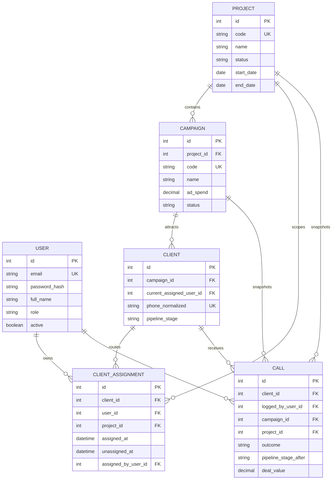

# Sales Call Tracker Implementation Plan

## Product Direction

Build a mobile-first sales operations application for a clinic-management SaaS team. The primary workflow is immediate: select a lead, call or open WhatsApp, then record the outcome before context is lost. The admin can provision sales users, set their role, assign work by project and campaign, and review individual and team KPIs.

The build deliberately starts with a high-fidelity frontend mock. No database, authentication provider, or Server Action is introduced until the visual system, workflows, responsive behavior, loading states, and empty states are approved.

## Scope Decisions

### Roles

| Role | Purpose | Access |
| --- | --- | --- |
| Admin | Owns operations, people, attribution, and configuration. | Full access to users, projects, campaigns, assignments, reports, picklists, and all leads. |
| Sales Manager | Leads a team and monitors coaching KPIs. | Assigned projects and campaigns, team leads, team reports, and team assignments. |
| Sales Rep | Works leads and records calls. | Assigned leads and campaigns, own performance, quick call logging, and profile settings. |

Use permission capabilities in application code rather than scattered role-name checks. Version one uses the three roles above, but the data model supports adding a permission table later without rewriting records.

### Projects and Campaigns

A Project is an internal sales initiative, such as a territory, product rollout, or quarter-specific sales drive. A Campaign is an external acquisition source, such as a Facebook or Instagram ad campaign. A campaign belongs to one project. Every client is attributed to a campaign; a call snapshots both campaign and project at the time it is logged.

Projects and campaigns can be archived, never hard-deleted once referenced. Archiving prevents new assignment and data entry while preserving reports.

### KPI Principles

KPIs must be query-derived, filterable by date range, project, campaign, team, and sales user, and calculated from immutable attribution snapshots. No dashboard card is a manually maintained total.

| KPI | Definition |
| --- | --- |
| Leads assigned | Distinct clients assigned to a sales user in the selected period. |
| New leads worked | Assigned leads with a first logged call in the selected period. |
| Calls made | Non-deleted calls logged by the sales user. |
| Contact rate | Clients with at least one answered call divided by worked leads. |
| Follow-up compliance | Follow-ups due in the period that received a qualifying call on or before the due date divided by all due follow-ups. |
| Conversion rate | Clients closed won divided by leads in the selected attribution scope. |
| Revenue | Sum of deal values on closed-won calls. |
| Average deal value | Revenue divided by closed-won calls. |
| Calls to close | Average calls per client for clients closed won. |
| Time to close | Average days from first contact to the call that closed the client won. |
| Pipeline coverage | Open pipeline value divided by the selected revenue target, when targets are configured. |

## Target Information Model

### Required Data and Audit Rules

- `User` stores an email, password hash, display name, role, active state, optional manager, and timestamps. Never store a password or session token in plain text.
- `Project` stores a generated code, name, description, date range, status, optional revenue target, and timestamps.
- `Campaign` gains `projectId`, status, optional target values, and timestamps. Its project attribution is preserved on each call.
- `Client` keeps the current assignee for fast operational queries and gains an assignment history relation for auditability.
- `ClientAssignment` is append-only. Reassignment closes the prior record and creates a new record in the same transaction.
- `Call` replaces the temporary `salesRep` text with required `loggedByUserId`; it snapshots `campaignId` and `projectId`. Do not update these snapshots when a client, campaign, project, or assignee changes later.
- `AuditLog` records admin changes to users, roles, projects, campaigns, assignments, picklists, and deleted calls. It includes actor, action, resource type, resource id, timestamp, and before/after JSON.
- All operational tables use `createdAt`, `updatedAt`, and `deletedAt` where soft deletion is needed. KPIs exclude deleted calls by default, while audits retain them.
- Database constraints and service-layer authorization enforce ownership, valid active references, unique normalized phones, and allowed state transitions.

## UI Direction

The visual system is built, approved, and frozen in `docs/UI_RULES.md`. That document is binding: every new screen, component, and state must match it exactly, and any change to the system is made there first and in the code in the same change. The summary below is orientation only; the rules file wins on any detail.

- Focused operations console, not a generic admin template: quick scanning, one-handed mobile action, dense desktop work.
- One font (Plus Jakarta Sans), a neutral light or dark workspace, and a vibrant blue primary that carries the action hierarchy: blue pill = primary action, soft blue tint = secondary action, one blue-gradient hero surface per view, green/red/amber tints for status. Black is reserved for navigation surfaces (rail, dock) and never appears in content components.
- Desktop navigation: an 80px icon rail on a dark canvas that expands on hover or keyboard focus and collapses after a click, containing Home, Leads, Projects, Campaigns, Reports, Team, and Settings; permissions control visibility. The workspace is an inset white panel with a header holding the page title, command launcher trigger, theme toggle, notifications, account menu, and the primary Log Call action.
- Mobile navigation: a native-feeling app bar (menu, title, search, notifications, primary Log Call circle), a floating frosted bottom bar with four expanding tabs (Home, Leads, Campaigns, Reports), and a dock drawer with the full navigation, theme toggle, and account actions. Admin is reached from the drawer and the account menu.
- Light and dark themes are first-class (`next-themes`, system default). Every component is verified in both before it is done.
- All interactive targets are at least 44px on every breakpoint. Tables become stacked, action-oriented rows below the `md` breakpoint.
- Show real-looking deterministic fixture data. Every screen includes loading, empty, error, disabled, and permission-restricted states.

### The dashboard is now the real Phase 2 design, still on fixture data

`src/features/dashboard/today-dashboard.tsx` (route `/`) is the actual Today dashboard called for in Phase 2, not a throwaway mock — its cards were derived from the KPI principles above and it is the layout to keep building on. What it does not yet have is real data: every number comes from `fixtures/today.fixture.ts`, there is no role-based scoping behind the "My performance / Team performance / All workspace" selector, and interactions like "Log a call" and the follow-up call buttons are not wired to persistence. Phase 1's original reference mock (`src/features/dashboard/dashboard-overview.tsx` and its fixtures) was deleted once this dashboard shipped and superseded it; nothing should be built against it or reference it again.

### shadcn/ui Component Plan

Initialize with the current shadcn CLI and use generated primitives only under `src/components/ui`.

| Workflow | Primitives |
| --- | --- |
| Application shell (built) | Button, Tooltip, Avatar, Dropdown Menu, Separator, Sheet, Dialog, Command; the rail, tab bar, and dock are bespoke shared components under `src/components/shared/app-shell` |
| Login and user management | Card, Form, Input, Label, Select, Switch, Alert, Dialog |
| Leads and assignments | Table, Data Table pattern, Command, Popover, Combobox, Badge, Tabs, Checkbox |
| Quick Log Call | Responsive Dialog/Sheet wrapper, Command, Form, Textarea, Calendar, Popover, Select, Sonner |
| Projects and campaigns | Card, Form, Date Picker composition, Tabs, Progress, Badge |
| Reports and KPIs | Card, Tabs, Select, Skeleton, Chart primitives or Tremor after compatibility validation |
| Safety interactions | Alert Dialog, Toast/Sonner, Dropdown Menu, Pagination when required |

Use Lucide icons in icon buttons. Do not hand-edit generated shadcn primitives. Compose them in feature components and restyle them through the recipes in `docs/UI_RULES.md` (`Surface`, `pill.ts`, `circleButtonClass`). Shared visual components live in `src/components/shared`; feature-local ones in `src/features/<feature>/components`.

## Phased Delivery Plan

### Phase 0: Product Contract and Technical Baseline

**Goal:** Lock decisions that affect every later phase.

1. Convert this plan and the existing briefing into acceptance criteria grouped by user role.
2. Confirm PostgreSQL provider and pooled connection strategy, deployment environment, password policy, seed admin identity, currency, timezone, and the definition of an answered call.
3. Generate version-aligned `AGENTS.md` using `npx @next/codemod@canary agents-md`.
4. Initialize shadcn with the installed Next.js/Tailwind version and verify generated components type-check.
5. Add quality tooling: environment schema validation, formatting policy, unit-test runner, integration-test database strategy, and end-to-end browser test runner.
6. Establish CI for type checking, linting, unit tests, integration tests, and production build.

**Exit criteria:** architecture decisions documented, no secrets committed, CI verifies a clean scaffold, and the component system is installed from its CLI.

### Phase 1: Visual System and Application Shell (Frontend Only) — complete

**Goal:** Produce an approved responsive visual language using fixture data only.

Delivered and approved (September 16, 2026):

1. Tokens for color, radius, typography, elevation, chart ramp, and status colors in `src/app/globals.css`, with light and dark values.
2. The responsive shell in `src/components/shared/app-shell`: expanding desktop rail, workspace header, mobile app bar, expanding-tab bottom bar, dock drawer, account menu, theme toggle, and the Ctrl/⌘+K command launcher.
3. Shared visual components: `Surface` family, pill and chip recipes, circle icon button, page placeholder, theme provider and toggle.
4. A dashboard reference mock in `src/features/dashboard` with deterministic fixtures, since superseded and deleted by the real Phase 2 Today dashboard (see below).
5. Screenshot verification at 375px, 768px, and 1440px in both themes.

The outcome is codified in `docs/UI_RULES.md`. Remaining Phase 1 items are folded into the first Phase 2 screens rather than built in isolation: status badge, metric delta, filter bar, in-card empty and error states, responsive dialog/sheet wrapper, and confirm dialog. Each is added as a shared component the first time a real screen needs it, following the rules file, and the rules file is updated in the same change.

**Exit criteria (met):** the shell is accessible by keyboard, tap targets meet the 44px requirement, tokens prevent ad hoc styling, and the rules file makes the system reproducible.

### Phase 2: Core Sales Workflow Mock (Frontend Only) — mostly complete

**Goal:** Prove the fastest daily workflow before persistence exists.

Delivered:

1. The Today dashboard (`src/features/dashboard/today-dashboard.tsx`) replaced the Phase 1 reference mock outright — the mock and its fixtures were deleted once this shipped. It has a personal/team scope switch, a workspace-pulse hero, a four-tile KPI strip, due/overdue follow-ups, a needs-attention list, recent activity, and pipeline momentum, all from `fixtures/today.fixture.ts`.
2. Leads (`src/features/clients/components/leads-workspace.tsx`) as a desktop table and mobile action cards, with one-tap Call, WhatsApp, and Log Call, search-free filter/sort via the shared `FilterMenu`, an assignee column, aging (`lastCall`/`nextFollowUp`), and campaign/project badges. Fixtures in `fixtures/leads.fixture.ts`.
3. Client detail (`src/app/(app)/leads/[clientId]/page.tsx`, `client-detail.tsx`) as a single responsive page (not a desktop drawer — a full page reads better for the call-history depth involved) with profile metrics, full call history newest-first, lead context, and a pinned Log Call action.
4. Quick Log Call (`quick-log-call.tsx`) built on the shared `ResponsiveDialog` (bottom sheet on mobile, centered dialog on desktop, single mounted root — see `docs/UI_RULES.md` §5): outcome, an adjacent outcome note, stage select, follow-up date with quick presets, and a success state.
5. Bulk import (`bulk-import-leads.tsx`) parses pasted phone numbers, normalizes them, flags duplicates against existing leads, and shows a live preview before import, plus an empty state before anything is pasted.
6. All of the above use local component state and fixture data only; no Server Actions or persistence.

Not yet done: optimistic success/error simulation with artificial latency, and inline validation error states on the Quick Log Call form — add these when the screen is wired to a real action in Phase 5, since they are meaningful to demonstrate only against real async behavior.

**Exit criteria:** met for the search → call → return → log → review-history loop on both desktop and mobile. The outcome note is visible on every call history entry.

### Phase 3: Admin, Team, Project, and KPI Mock (Frontend Only) — complete

**Goal:** Make administrative control and performance reporting concrete before schema work.

Delivered:

1. Login, forgot-password, reset-password, activate-account, and session-expired screens under the `(auth)` route group (`src/app/(auth)/*`), on a dedicated `AuthShell` layout with no rail or header. Login validates required fields inline, simulates a network delay, and shows a real error banner for any password other than the demo value (`"demo"`); reset/activate share `SetPasswordForm` (mismatch and length validation, then a success state); forgot-password shows a "check your email" success state that never confirms or denies the account exists. Every "Log out" control in the shell (rail, dock, account menu) now routes to `/login`.
2. Team management (`src/features/team/team-workspace.tsx`): roster table/cards, role and status chips, search and role/status filters, an Invite dialog, and a Manage dialog (permissions, assignments, save) — both on `ResponsiveDialog`.
3. Projects (`src/features/projects/components/projects-workspace.tsx`): card list with status, health, campaign/lead/member counts, and a target-vs-actual progress bar; a New Project dialog and a Manage Project dialog (edit target, manage campaigns, archive). Scoped as list + dialogs rather than a separate detail route, matching the Team pattern.
4. Campaigns (`src/features/campaigns/components/campaigns-workspace.tsx`): table/cards with platform, project, and status filters, leads/calls/won/spend/revenue/ROAS columns, a New Campaign dialog, and a Manage Campaign dialog with a spend-vs-revenue summary and pause/resume.
5. Lead assignment flows on the Leads workspace: checkbox row selection (desktop table and mobile cards, gated to roles that can reassign), a sticky selection bar, and a Reassign dialog showing each teammate's current active-lead count as a workload preview before confirming. Client detail (`client-detail.tsx`) gained an Assignment history card driven by `assignmentHistoryFor()` in the leads fixture.
6. Reports (`src/features/reporting/reports-workspace.tsx`): period filter, Overview/Conversion/Team-performance tabs (Team performance hidden for roles that can't view it), a KPI strip, a hero revenue-trajectory chart, pipeline funnel, call-outcome mix, campaign efficiency table, forecast card with a scenario selector, team leaderboard, and an activity heatmap (leaderboard/heatmap replaced by a restricted placeholder for roles that can't view team data).
7. Role-preview mode: `src/lib/roles.ts` defines `Role` and the capability functions; `RolePreviewProvider`/`useRolePreview()` (mounted in `AppShell`) track an admin-only "preview as" override, switchable from the account menu (desktop) or the dock (mobile) without changing the signed-in identity. Navigation (rail, dock, command launcher) filters through `navigationFor(effectiveRole)`; whole pages are gated with `RoleGate`; in-page sections (Settings' Workspace tab, Reports' Team performance tab/leaderboard, the Leads reassignment UI, the Today dashboard's scope selector) gate individually and react live if the previewed role changes while the page is open. A `RolePreviewBanner` shows whenever a preview is active.

Also delivered outside this phase's original list, because they were needed for the shell to be complete: a Settings page (`src/features/settings/components/settings-workspace.tsx`) with Profile, Workspace, Notifications, and Security tabs — profile fields, currency/timezone/answered-call-definition, notification toggles, password change, two-factor toggle, and active-session management. The Workspace tab is Administrator-only, gated the same way as Team/Projects.

**Exit criteria:** met. An admin can add a sales rep (Invite dialog), assign them to a project/campaign implicitly via the fixture data, distribute leads (Reassign), inspect KPIs (Reports), and review every screen as Admin, Manager, or Rep via role preview — including what each role cannot see.

### Phase 4: Persistence, Identity, and Authorization Foundation

**Goal:** Add the production data and security foundation beneath the approved UI.

1. Install and configure TypeORM with PostgreSQL pooled connections, explicit migrations, a non-production seed workflow, and repository-based services.
2. Implement entities and migrations for User, Session, Project, Campaign, Client, ClientAssignment, Call, PicklistOption, and AuditLog.
3. Seed exact picklists from the briefing and a development-only admin user. Use database sequences for cosmetic human-readable codes.
4. Implement password hashing with a current, maintained library; use opaque, secure, httpOnly, sameSite cookies for sessions; rotate or invalidate sessions on password reset/deactivation.
5. Implement `proxy.ts` for route gating and service-level authorization for every mutation and protected query. The proxy is an optimization, not the security boundary.
6. Add Zod schemas shared between forms and Server Actions. Actions validate input, authorize the actor, invoke a service, and return typed results.
7. Add a complete audit trail for admin changes and destructive call actions.

**Exit criteria:** authenticated users can access only authorized routes and data; migrations apply cleanly to an empty database; sessions and passwords are never exposed to client code or logs.

### Phase 5: Transactional Core Operations

**Goal:** Connect the daily workflow to production data safely.

1. Implement phone normalization and duplicate detection with unit tests.
2. Implement project/campaign CRUD, archive behavior, and live source metric updates.
3. Implement users, role changes, activation/deactivation, manager relationships, and assignment management with audit logging.
4. Implement clients and bulk import. Assign imported leads according to the admin-selected user or a documented unassigned state.
5. Implement the call-logging transaction: validate active user/client/campaign/project, snapshot attribution and actor, create call, update client stage, create/refresh follow-up state, and invalidate live views atomically.
6. Implement call edit/delete behavior. Only an edit to the newest effective call can recompute current client stage; deletion is soft and audited.
7. Connect UI fixture adapters to Server Actions one feature at a time, retaining typed presentation models so UI components stay independent of TypeORM entities.

**Exit criteria:** every UI mutation is authorized, validated, transactional where needed, auditable, and covered by unit or integration tests. The primary dial-to-log flow remains under the interaction target on a production-like mobile device.

### Phase 6: Reporting and Operational Intelligence

**Goal:** Deliver trustworthy, role-aware KPIs.

1. Implement versioned SQL views for campaign, project, client, sales-user, assignment, weekly activity, and follow-up-compliance stats.
2. Build typed reporting services over those views; use one metrics definition across dashboard, reports, exports, and campaign/project detail pages.
3. Scope data by role: reps receive their own assigned/current work and personal KPIs; managers receive their teams; admins receive all authorized records.
4. Add drill-down tables behind every KPI and chart. A number without an inspectable source list is incomplete.
5. Implement CSV export with the same authorization and filter predicates as the visible table.
6. Apply narrow Next.js cache tags only to stable picklists; keep operational metrics live and invalidate/revalidate correctly after mutations.

**Exit criteria:** the displayed leaderboard, campaign stats, dashboard, and CSV exports agree for the same filters; fixture expectations are reproduced in integration tests.

### Phase 7: Hardening, Performance, and Launch

**Goal:** Prepare the application for real operators and production deployment.

1. Add rate limits to login, password reset, bulk import, and search actions; add structured error handling and monitoring.
2. Add database indexes for normalized phone search, active assignments, campaign/project/date reporting, client stage, follow-up date, and call actor/date queries; verify plans with representative seed volume.
3. Add accessibility tests, keyboard navigation checks, mobile browser tests, and visual regression screenshots for all critical workflows.
4. Run threat-model review: authorization bypass, IDOR, session fixation, CSRF, open redirects, data export access, and sensitive data in logs.
5. Configure Vercel and PostgreSQL environment variables, migrations release procedure, backups, health checks, and rollback playbook.
6. Perform pilot onboarding with one admin and one sales rep; compare KPI results with a controlled source dataset before full migration.

**Exit criteria:** all CI checks pass, test coverage protects critical services, mobile workflows are verified, monitoring is active, and pilot KPI reconciliation is accepted.

## Work Sequencing Rules

- Complete Phases 1 through 3 as frontend-only work. Do not connect real data or authentication before visual approval.
- After Phase 3 approval, execute Phase 4 before wiring any production mutation from the mock UI.
- Build vertical slices in Phase 5: one UI feature, its validation, action, service, migration, test, and audit behavior together.
- Do not add an admin action until its permission check, audit event, loading state, success state, empty state, failure state, and mobile behavior are defined.
- Do not optimize a query based on intuition. Add indexes after measuring the reporting and operational queries against representative data.

## Acceptance Gates

| Gate | Required Evidence |
| --- | --- |
| Frontend approval | Desktop and 375px screenshots in light and dark, `docs/UI_RULES.md` definition-of-done checklist satisfied, interaction walkthrough, role-preview review, and stakeholder sign-off. |
| Authentication readiness | Security review, session tests, password reset tests, role matrix tests, and no secrets in repository. |
| Operations readiness | Integration tests for phone uniqueness, assignment history, call-stage transaction, soft deletes, and attribution snapshots. |
| KPI readiness | SQL view tests with known fixtures, cross-screen reconciliation, and filter/role scoping tests. |
| Launch readiness | Production build, accessibility checks, E2E critical paths, migration rehearsal, backup/rollback plan, and pilot reconciliation. |

## Initial Implementation Order

Phases 1 through 3 are complete: the visual system, the core sales workflow (Today dashboard, Leads, client detail, Quick Log Call, bulk import), and the admin/team/project/KPI mock (Team, Projects, Campaigns, Reports, Settings, auth screens, lead assignment, and role-preview) are all built to `docs/UI_RULES.md`. The next implementation task is Phase 4: install TypeORM against pooled PostgreSQL, add the real entities and migrations, wire real password hashing and sessions behind the now-built login/reset/activate/session-expired screens, and implement `proxy.ts` route gating so the client-side `RoleGate`/`navigationFor` checks built in Phase 3 are backed by real server-side authorization rather than being the boundary themselves. Everything built so far must keep matching `docs/UI_RULES.md` exactly — it is binding, not descriptive.
